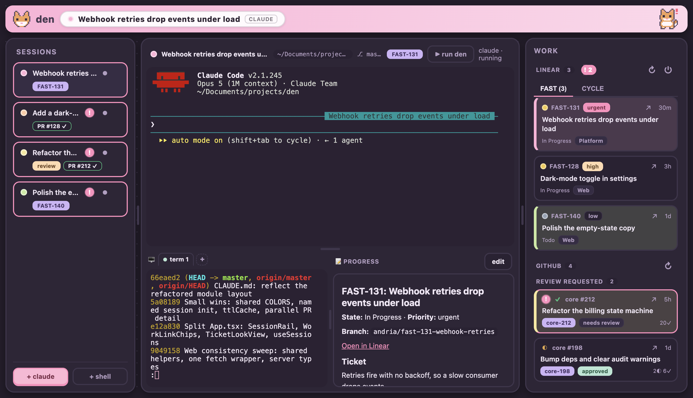
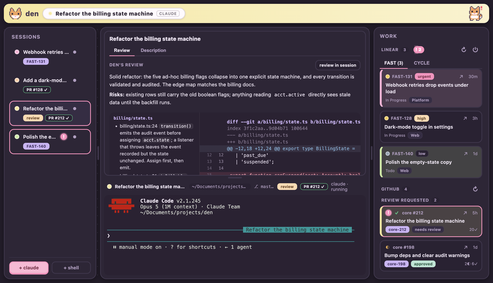
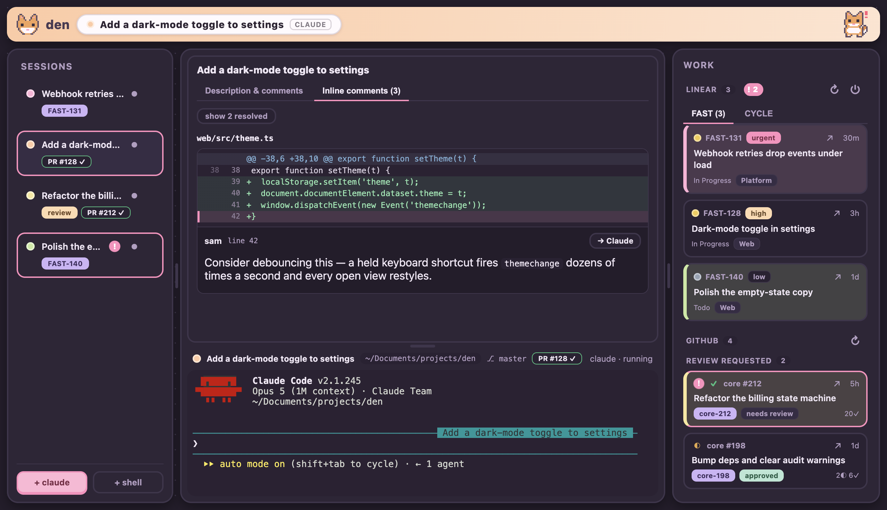
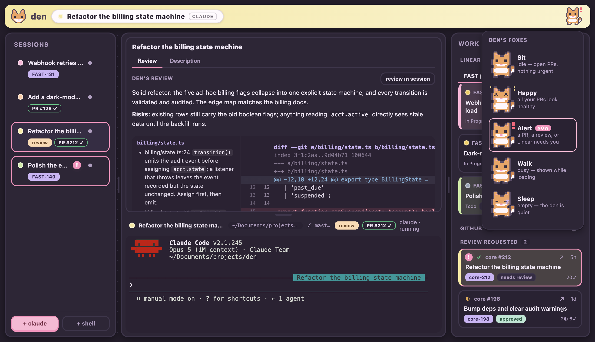
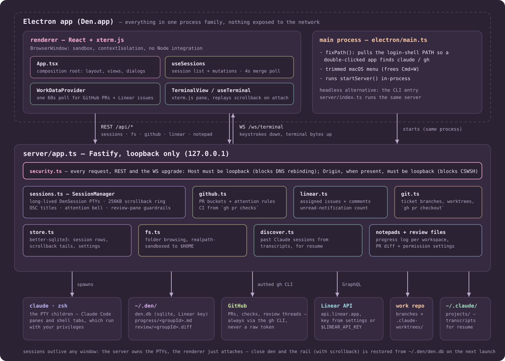

# 🦊 den

> A cozy, pixel-art cockpit for Claude-driven development — one home for all your
> Claude Code sessions, each tied to its GitHub PR and Linear ticket, instead of
> juggling terminal tabs.



den is a small desktop app (Electron + React). Sessions live in a rail on the
left; the middle is a **Claude workspace** — a Claude Code pane, shell tabs, and
a live progress notepad; the right is a **work panel** that pulls your GitHub PRs
and Linear tickets. A reactive pixel fox up top tells you when something needs
you. Sessions are server-owned, so they outlive any window and survive restarts.

## Highlights

- **Many sessions, one home.** Persistent Claude/shell sessions you can rename,
  recolour (9 distinct pastels), and switch between; scrollback replays on
  switch *and* after a restart. An exited session restarts in place with one
  click, keeping its cwd/branch/ticket/PR.
- **Tied to your work.** Open a Linear ticket or GitHub PR and den spins up a
  Claude session on the right branch (local or a git worktree), tagged with its
  ticket/PR so you always know what a session is for.
- **Review PRs in-app.** For others' PRs, the Claude session below the diff
  does the reviewing: it gets the full diff as a file, runs the finding pass,
  and writes its review to the workspace notepad — den renders the general
  review up top and **each file's comments beside that file's hunks**. The
  session has a full shell (running the tests is part of reviewing) but is
  instructed, with a permission-deny backstop, to never commit, push, or post
  to GitHub.

  

  A **Guide** tab reads the PR in the order it was written instead of file
  order: Claude groups the changed files into sections — the core of the change
  first, churn last — explains what each group does and what it risks, and den
  renders that explanation above that group's own diffs.

  For your own PRs: description, reviews, and inline comments grouped by file
  with the code they point at — resolved threads tucked behind a toggle. Every
  comment has a **“→ Claude”** button that hands it to the session's Claude to
  action.

  

- **A fox that reads the room.** The topbar fox goes **alert** when a PR needs
  you (failing CI, changes requested, or a review you owe) or Linear has unread
  notifications, **happy** when your PRs are healthy, and curls up to **sleep**
  when the den is quiet.

  

- **Cozy and keyboard-friendly.** Pastel theme, resizable panes, arrow-key
  roving focus, native notifications, and `⌘/Ctrl` + `N` / `T` / `W` / `1–9`
  shortcuts. Even den's own source opens as a self-editing workspace (the
  far-left fox).

## Run

### As a desktop app (Electron)

```bash
npm install
npm run app      # rebuilds native modules for Electron, builds, and launches
```

A native window opens. The Node server runs inside Electron's main process on an
ephemeral port. Session data lives in `~/.den/den.db`.

### Build a double-click `.app`

```bash
npm run pack     # unsigned Den.app in release/mac-arm64/ (local use)
cp -R release/mac-arm64/Den.app /Applications/
```

### In the browser (fast dev loop)

```bash
npm run rebuild:node   # only after running the app (see ABI note)
npm run dev            # server on :4321, web on :5173 — open the latter
```

> **Native-module ABI note:** `node-pty` and `better-sqlite3` are native and
> must match their runtime. `npm run app` rebuilds them for Electron;
> `npm run rebuild:node` rebuilds them for plain Node (browser dev). Switch with
> those two commands when moving between the app and browser dev.

Requires the `claude` and `gh` CLIs on your `PATH`; Linear is optional (paste a
personal API key in the work panel).

## How it works



(The same map lives inside the app — click the topbar status fox.)

- A Node/TypeScript backend runs **inside** Electron's main process (also
  runnable standalone via a CLI). Terminals stream over a WebSocket; everything
  else is REST.
- `server/` — long-lived PTYs (`sessions.ts`), a `better-sqlite3` store, and the
  `gh` / Linear / `git` integrations. `web/` — React + xterm.js.
- The server is a **loopback-only control plane**: it rejects cross-origin /
  DNS-rebound requests, sandboxes file browsing to `$HOME`, validates branch and
  path inputs, and never stores or logs your API keys in the repo (the Linear
  key lives only in `~/.den/den.db`, which is gitignored).

## Security

**den runs commands on your machine as you.** It spawns real shells and Claude
Code / `git` / `gh` processes with your privileges — that's the whole point, but
it also means the local server is as trusted as your terminal. Treat it that way:

- **Keep it on loopback.** The server binds `127.0.0.1` and, in the app, an
  ephemeral port. An `onRequest` guard (`server/security.ts`) rejects any request
  whose `Host` isn't loopback (blocks DNS-rebinding) or whose `Origin`, when
  present, isn't loopback (blocks cross-site WebSocket/fetch hijacking) — for REST
  **and** the terminal WebSocket. **Don't** put it behind a tunnel or bind it to
  `0.0.0.0`; anyone who can reach the port can run commands as you.
- **Input hardening.** Shell-outs use `execFile`/`spawn` with argument arrays
  (never a shell string); branch names are validated (a leading `-` can't become
  a flag); file browsing is realpath-sandboxed to `$HOME`; the notepad id is
  checked against path traversal.
- **Secrets.** Your Linear API key lives only in `~/.den/den.db` (gitignored) or
  `$LINEAR_API_KEY` — it's never returned to the client or logged, and errors are
  sanitized before they reach the UI.
- **Electron.** The renderer runs with `sandbox`, `contextIsolation`, and no Node
  integration; navigation is pinned to the app origin and only `http(s)` links
  reach the OS.

Found something? Please open an issue (or email the maintainer) rather than a
public PoC.

## Develop

```bash
npm run check   # typecheck + eslint + vitest
```

Tests cover the pure, rule-heavy logic (the loopback guard, PR attention rules,
branch validation, the path sandbox, the fox pose). Architecture, conventions,
and the hard-won gotchas are documented for contributors in
[`CLAUDE.md`](CLAUDE.md).

## License

[MIT](LICENSE) © Andria Hibe

---

_Screenshots use fictional demo data._
